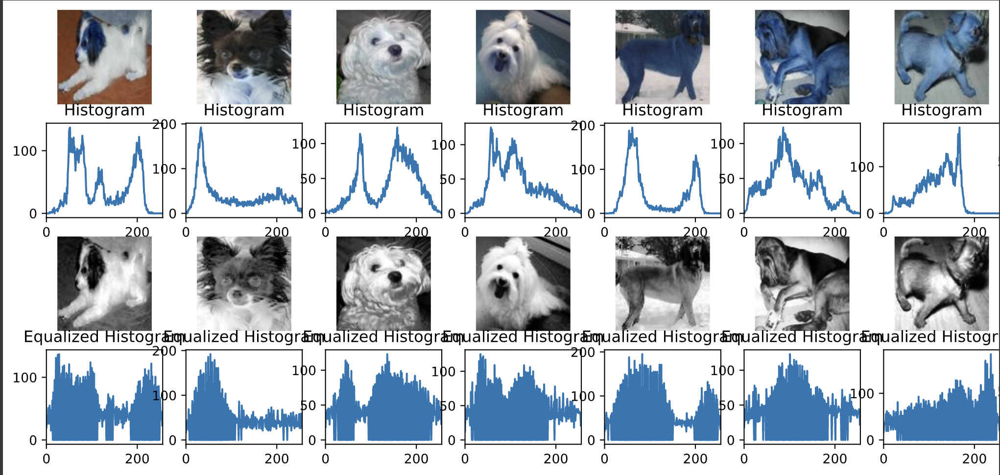

Data Mining Assignment: 1

**Stanford Image Dataset**

**Overview**

The Stanford Image Dataset is a collection of images belonging to four distinct classes: Maltese dog, Brabancon griffon, Papillon, and Bloodhound. This dataset is intended for use in image classification and computer vision tasks. Each class represents a different breed of dog.

**Dataset Structure**

The dataset is organized into subfolders, with each subfolder representing a specific class. Here's an overview of the dataset structure:

Maltese dog: This class contains images of Maltese dogs.
Brabancon griffon: This class contains images of Brabancon griffon dogs.
Papillon: This class contains images of Papillon dogs.
Bloodhound: This class contains images of Bloodhound dogs.

